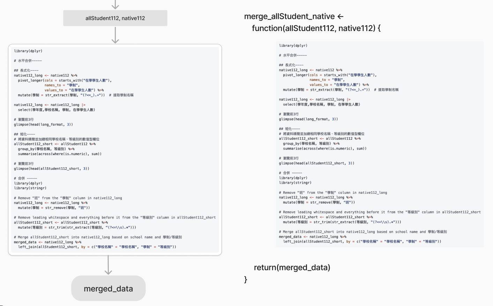

# 函數

由於程式多是一條直線式的執行（也叫single thread）到底，在每一段直線我們可以看到input（待解決任務的訊息）和output （任務解決後的產出）的影子，例如： 

https://github.com/tpemartin/112-2-R-EE/blob/9624b517bc8a5bf1cb2757bb546ddd3a22fb9fd0/Lecture%20notes/week10.md?plain=1#L85-L143

## 作法

[](https://www.figma.com/file/JF501BeiuwS0C1Hz0tfCyh/teaching-R?type=whiteboard&node-id=26-155&t=qoKsCm8otfQtDuNQ-4)

## 模組化

模組化是指將程式碼分成一個個小模組，每個模組負責一個特定的功能。這樣的好處是可以讓程式碼更容易維護，也可以讓程式碼更容易重複使用。

一個模組檔是一個R script檔，裡面包含了一個或多個函數, 通常這些函數有相關性，例如：一個統計分析模組檔裡面可能包含了一個函數用來計算平均值，另一個函數用來計算標準差。

  - 將`merge_allStudent_native`函數放入`merge.R`檔案裡。  
  - 若要使用`merge_allStudent_native`函數，只需要在R script檔案裡面加入`source("merge.R的路徑")`，就可以使用`merge_allStudent_native`函數。

## 水平合併多學年


- [大專校院原住民學生及畢業生人數—按等級別與校別分](https://data.gov.tw/dataset/33514)  
- [大專院校校別學生數](https://data.gov.tw/dataset/6231)

[AI>>](./week11-prompt.md#水平合併多學年)

## 範例程式

```r

## 所有學生 ----
allStudent112 <- read_csv("112_student.csv")

## 原住民學生 ----
native112 <- read_csv("112native_A1-1.csv")
  
library(dplyr)

# 水平合併-----

## 長式化----
native112_long <- native112 %>%
  pivot_longer(cols = starts_with("在學學生人數"), 
               names_to = "學制", 
               values_to = "在學學生人數") %>%
  mutate(學制 = str_extract(學制, "(?<=_).+"))  # 提取學制名稱

native112_long <- native112_long |>
  select(學年度,學校名稱, 學制, 在學學生人數)

## 短化----
# 將資料精簡並加總相同學校名稱、等級別的數值型欄位
allStudent112_short <- allStudent112 %>%
  group_by(學校名稱, 等級別) %>%
  summarise(across(where(is.numeric), sum))

# 瀏覽前3行
glimpse(head(allStudent112_short, 3))

# 合併 -----
library(dplyr)
library(stringr)

# Remove "班" from the "學制" column in native112_long
native112_long <- native112_long %>%
  mutate(學制 = str_remove(學制, "班"))

# Remove leading whitespace and everything before it from the "等級別" column in allStudent112_short
allStudent112_short <- allStudent112_short %>%
  mutate(等級別 = str_trim(str_extract(等級別, "(?<=\\s).*")))

# Merge allStudent112_short into native112_long based on school name and 學制/等級別
merged_data <- native112_long %>%
  left_join(allStudent112_short |> select(-學年度), by = c("學校名稱" = "學校名稱", "學制" = "等級別"))

# Display the first 3 rows and structure of the resulting merged data frame
glimpse(head(merged_data, 3))

# 更改 '在學學生人數' 欄位名為 "原住民生人數"
merged_data <- merged_data |>
  rename("原住民生人數"='在學學生人數')

## 水平合併歷學年資料
source("r/merge.R")

# Data Manipulation with Tidyverse -----
# Create an empty list to store merged data
merged_data_list <- list()

# Loop through each year from 104 to 112
for (year in 104:112) {
  # Generate URLs
  native_url <- paste0("https://stats.moe.gov.tw/files/ebook/native/", year, "/", year, "native_A1-1.csv")
  allStudent_url <- paste0("https://stats.moe.gov.tw/files/detail/", year, "/", year, "_student.csv")
  
  # Download and import native data
  native <- read.csv(native_url)
  native$學年度 <- year  # Add '學年度' column
  
  # Download and import allStudent data
  allStudent <- read.csv(allStudent_url)
  allStudent$學年度 <- year  # Add '學年度' column
  
  # 80 行。。。 用merge_allStudent_native112(allStudent112 = allStudent, native112 = native)來代表
  # Merge datasets for the current year using existing function
  merged_data <- merge_allStudent_native112(allStudent112 = allStudent, native112 = native)
  
  # Store merged data in the list
  merged_data_list[[as.character(year)]] <- merged_data
}

# View the structure of merged_data_list
str(merged_data_list)

```

merge.R 內容

https://github.com/tpemartin/112-2-R-EE/blob/e907d8e45ff998636285ca119c138f57b0afba61/r/merge.R#L1-L66

## 練習

1. 104-108的merged_data都要增加"總計"欄位。
2. 從[中選會](https://db.cec.gov.tw/ElecTable/Election?type=President)找到最近兩次總統大學的資料，以縣市為身份，水平合併兩次資料。