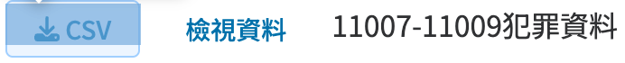
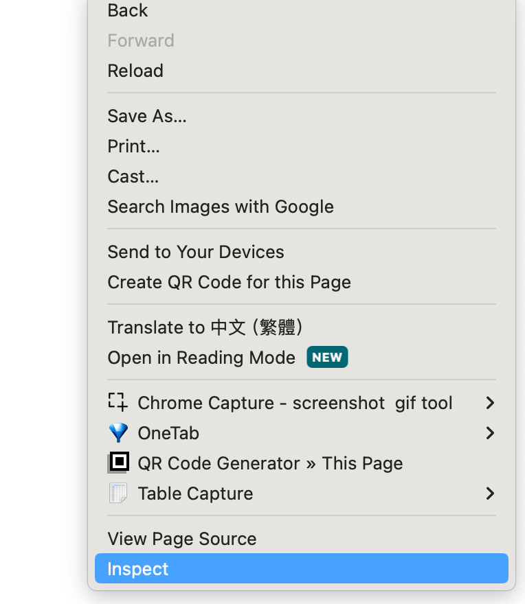
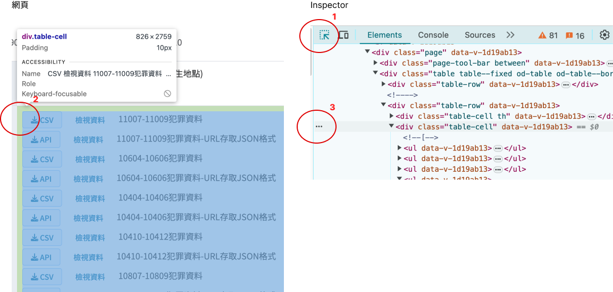

# 網頁爬蟲入門

網頁所看到的視覺呈現背後都有一個網頁原始碼，使用HTML語言撰寫。每一個視覺元素都有一個對應的HTML標籤，格式如下：

```html
<tagname attribute="value">content</tagname>
```

其中`tagname`為標籤名稱，`attribute`為屬性，`value`為屬性值，`content`為標籤內容。

例如：



當中的CSV下載按鍵的html語法為：

```html
<a href="https://data.moi.gov.tw/MoiOD/System/DownloadFile.aspx?DATA=F9D48036-DDE3-452A-8FD7-6437D6C39104" title="CSV下載檔案" target="_blank" data-v-1d19ab13="">...</a>
```

我們按這個鈕會觸發瀏覽器開啟新的分頁是來自於上述的`href`屬性，這個屬性的值就是下載的連結。

## 取得HTML原始碼

### 1. Inspector



### 2. Element Copy



  1. 點選UI選擇鈕
  2. 選擇UI元素
  3. 在Inpector中右鍵選擇Copy > Copy element

### 3. Element paste and save

將複製的內容貼到一個文字檔中(假設檔名為html.txt)，並存檔。

### 4. R read HTML

AI>>
> ```如何由html.txt讀入HTML原始碼, 並取出所有<a>標籤的href連結？```


### 5. 資料引入

AI>>
> ```href_links是字串向量，每個元素是一個網址, 針對每一個網址判斷是否帶有"DownloadFile"字眼，如果有就下載成csv檔並引入到R；如果沒有就不做任何事情，跳去處理下個元素。所有引入到R的資料都要收錄在一個list裡。```