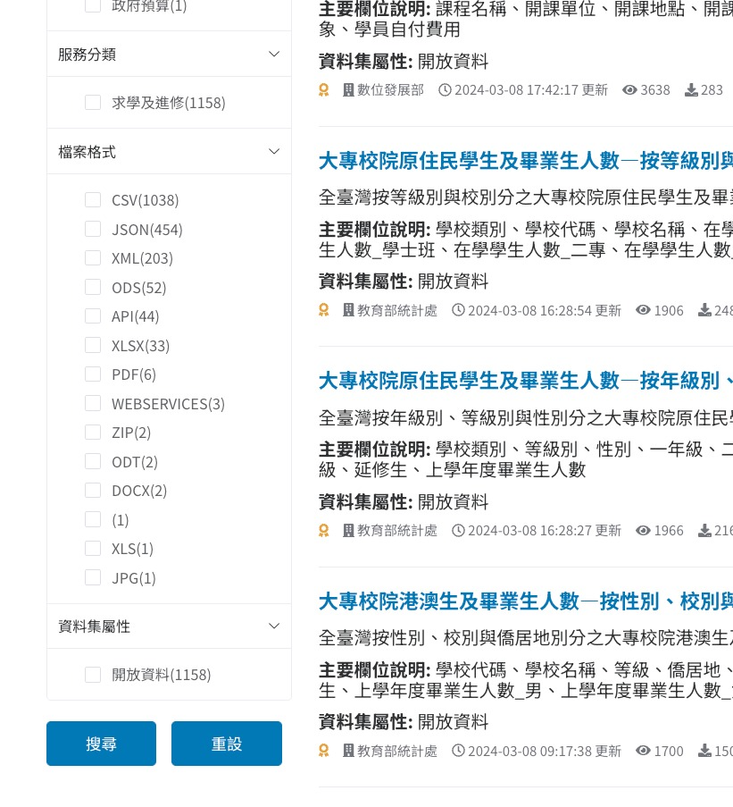
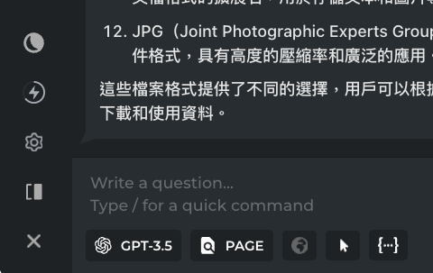

# Week 3 Session 1

- [1 Goals](#goals)
  - [1.0.1 Key concept: Harpa
    ChatGPT and API](#key-concept-harpa-chatgpt-and-api)
  - [1.0.2 key concept: Preset
    your AI chat](#key-concept-preset-your-ai-chat)
- [2
  如何引入外部資料到R](#如何引入外部資料到r)
  - [2.0.1
    常見資料格式](#常見資料格式)
  - [2.0.2 Key concept: (AI)
    透過page模式和網頁資訊聊天](#key-concept-ai-透過page模式和網頁資訊聊天)
  - [2.0.3 (AI)
    介紹這裡的檔案格式](#ai-介紹這裡的檔案格式)

# Goals

1.  Recap ChatGPT and Harpa user interface.
2.  

### Key concept: Harpa ChatGPT and API

ChatGPT是免費的但只能用gpt-3.5 model

API是使用者付費，可自由設定所使用的openAI models

### key concept: Preset your AI chat

> For the following chat, if the answer is programming related, use R
> only.

# 如何引入外部資料到R

### 常見資料格式

### Key concept: (AI) 透過page模式和網頁資訊聊天

點選右下角的page模式，可以透過網頁資訊和AI聊天，但會耗費更多的tokens。攜帶

> 不需要針對page時記得關掉page模式

### (AI) 介紹這裡的檔案格式
