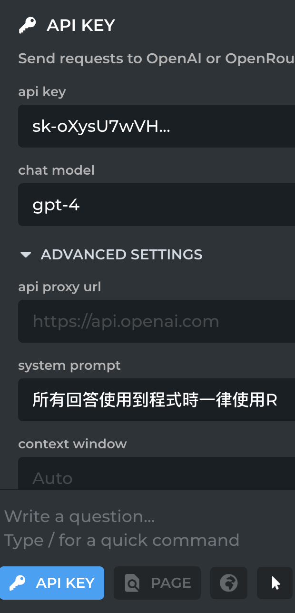

# Week 3 Session 2

- [1 Goals](#goals)
  - [1.1 Key concept: (AI) Harpa
    API下可以設定preset](#key-concept-ai-harpa-api下可以設定preset)
  - [1.2 引入Google
    sheets](#引入google-sheets)
  - [1.3 Key concept: data frame
    是像試算表結構的資料。](#key-concept-data-frame-是像試算表結構的資料)
  - [1.4 引入json](#引入json)
  - [1.5 Key concept:
    廣意的結構用list,
    list裡的第一層資料可以用第幾個元素或元素名稱來稱呼](#key-concept-廣意的結構用list-list裡的第一層資料可以用第幾個元素或元素名稱來稱呼)

# Goals

## Key concept: (AI) Harpa API下可以設定preset

## 引入Google sheets

## Key concept: data frame 是像試算表結構的資料。

## 引入json

<https://data.gov.tw/dataset/85848>

## Key concept: 廣意的結構用list, list裡的第一層資料可以用第幾個元素或元素名稱來稱呼
