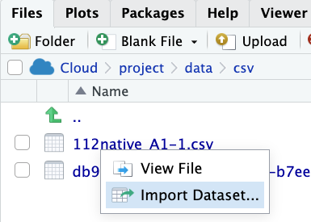
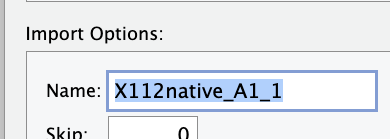

# 前情提要

## AI preset

AI>
```
所有回答使用到程式時一律使用R, 並盡量使用tidyverse語法, 答案以R script呈現  
```

  - 說明會以`#`開頭

## csv檔案的引入

### 範例： 

入載[112學年大專校院原住民學生及畢業生人數](https://data.gov.tw/dataset/33514)的CSV檔，並引入到R


#### 上傳到RStudio


#### 引入外部資料

AI>
```
如何引入csv檔案？
```

#### Key concept: 在RStudio裡可點選CSV檔直接引入



記得更改它在R環境中的名稱



#### 探索資料

> 各學校在不同年度的原住民學士班學生人數


#### Key concept: （AI）清楚交待由什麼物件開始探索資料

  - 使用到R環境裡什麼物件？物件類型（class）是什麼？
  - 要回答這個問題，需要使用這物件裡什麼元素？

AI>
```
`native`這個dataframe裡有"學校名稱"及"在學學生人數_學士班"兩個欄位，計算各學校的原住民學士班學生人數
```

#### Key concept: （AI）出現error把指令和錯誤訊息一起貼去問AI

AI>
```
> library(tidyverse)
Error in library(tidyverse) : there is no package called ‘tidyverse’
```

#### 輸出結果

##### 存成csv檔

##### 存成rds檔

rds檔案是R專用的資料格式，可以儲存R中的任何物件

##### 存到google sheets 

- 只適合data frame
- 小型資料集

> 這裡需要使用到GPT-4才會得到正確的答案

1. 連到<https://docs.google.com/spreadsheets>
2. 創立一個新的試算表, copy它的網址
3. 問AI如何將資料存到這個試算表

AI>
```
如何將`result` dataframe存到 {Google Sheets網址}？
```

## json檔案的引入

### 範例：

[公共建設類中長程個案計畫執行情形](https://raw.githubusercontent.com/tpemartin/112-2-R-EE/main/data/%E5%85%AC%E5%85%B1%E5%BB%BA%E8%A8%AD%E9%A1%9E%E4%B8%AD%E9%95%B7%E7%A8%8B%E5%80%8B%E6%A1%88%E8%A8%88%E7%95%AB%E5%9F%B7%E8%A1%8C%E6%83%85%E5%BD%A2.json) 

  - 出處：[政府資料開放平台](https://data.gov.tw/dataset/113779)

#### Chrome另存新檔


#### 上傳到RStudio


#### 引入外部資料


AI>
```
如何引入json檔案？
```


### Key concept: 透過點選在RStudio取得讀取元素值的程式碼

