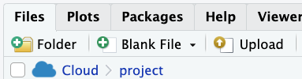
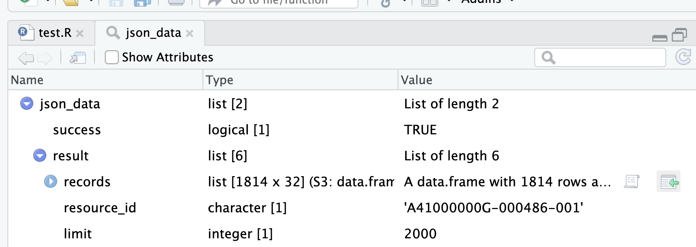

## json檔案的引入

### 範例：

[公共建設類中長程個案計畫執行情形](https://raw.githubusercontent.com/tpemartin/112-2-R-EE/main/data/%E5%85%AC%E5%85%B1%E5%BB%BA%E8%A8%AD%E9%A1%9E%E4%B8%AD%E9%95%B7%E7%A8%8B%E5%80%8B%E6%A1%88%E8%A8%88%E7%95%AB%E5%9F%B7%E8%A1%8C%E6%83%85%E5%BD%A2.json) 

  - 出處：[政府資料開放平台](https://data.gov.tw/dataset/113779)

#### Chrome另存新檔


#### 上傳到RStudio




#### 引入外部資料


AI>
```
如何引入json檔案？
```


### Key concept: 透過點選在RStudio取得讀取元素值的程式碼



### Key concept: 透過 `<-`可將取出來的值存成環境中另外的物件。
