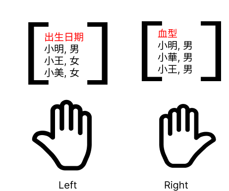

# 水平合併

## AI preset

AI》（答案呈現）
> 若使用到程式時一律使用R, 並盡量使用tidyverse語法, 答案以R script呈現。

AI》（任務確認）
> 所有任務請先重新以流暢的文字描述任務，再由我確認是否正確，我回答正確無誤後，才給予答案。對答案想法有疑慮時，要提出來請我𨤳清疑慮。每次回應前都必需重新說明任務的內容。

想像有兩個資料框（data frame）, 分別放在左手（left）和右手（right）, 水平合併就是把這兩個資料框合併在一起。



## 合併方式

  - left_join: 保留左邊的資料框所有資料，右邊的資料框有對應的資料則合併，沒有則填入NA
  - right_join: 保留右邊的資料框所有資料，左邊的資料框有對應的資料則合併，沒有則填入NA
  - inner_join: 保留兩個資料框"共"有的資料
  - full_join: 保留兩個資料框"所有"資料，有對應的資料則合併，沒有則填入NA

### 合併結果


## id欄位

id欄位是用來合併的依據。

> 相同名稱、性別的人當是同一人合併在一起，則id欄位是兩個資料框各自的名稱、性別欄位。

## AI prompt

AI》

> 將df_left與df_right進行水平合併：
>  - id欄位依據: "名稱", "性別"欄位，
>  - 合併方式: {{join method}}

`{{join_method}}`: 
    - 保留df_left的所有資料,
    - 保留df_right的所有資料,
    - 保留兩個資料框「共有」的資料,
    - 保留兩個資料框「所有」資料
  
## 練習範例

```r
# 水平合併
df_left <- data.frame(
  name = c("小明", "小王", "小美"),
  gender = c("男", "女", "女"),
  birthday = c("1990-01-01", "1991-02-02", "1992-03-03")
)

df_right <- data.frame(
  name = c("小明", "小華", "小王"),
  gender = c("男", "男", "男"),
  blood_type = c("A", "B", "O")
)
```

## 注意事項

- id欄位的計錄方式要一致，不能有一邊男性寫成"男"，另一邊寫成"男性"。

```r
df_right2 <- data.frame(
  name = c("小明", "小華", "小王"),
  gender = c("男性", "男性", "男性"),
  blood_type = c("A", "B", "O")
)
```

## 練習題

[中央銀行利率](https://cpx.cbc.gov.tw/Range/RangeSelect?pxfilename=EG2AM01.px)
[央行消費貸款及建築貸款餘額](https://www.cbc.gov.tw/tw/cp-526-1078-7BD41-1.html)

# Date/Time class

與日期有關的任務，時間相關欄位必須先轉換成R的Date/Time class

原始資料日期必需以西元年份來計錄

## AI prompt

AI》
> data frame `consumer` 有"年月底"欄位，它代表資料來自的年月，若其值有5個字則前3碼為年份，後兩碼為月份，若值有4個字則前2碼為年份後兩碼為月份; 這裡頭的年份值是正確西元年減1911的結果。請依"年月底"創造一個date time class的"日期"欄位
